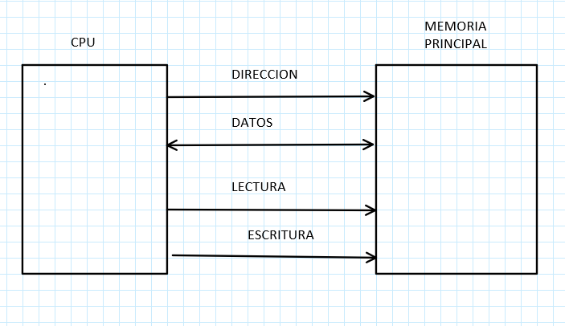
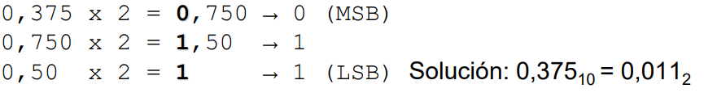
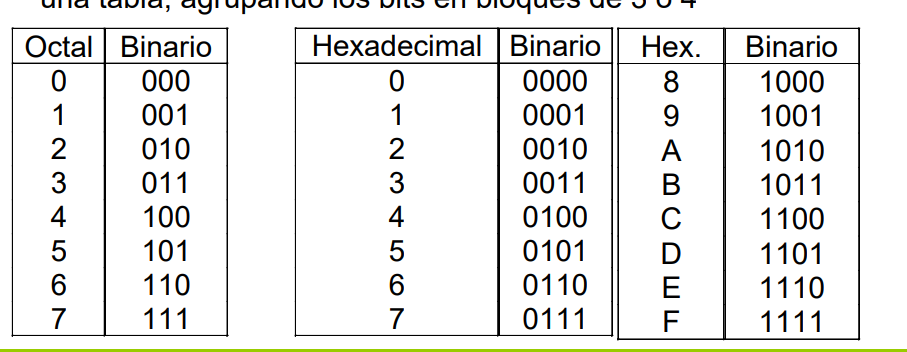

# TEMA 1 Introducción a los computadores #
## Objetivos ##
    - Conocer los términos básicos de la asignatura
    - Ofrecer una perspectiva histrórica de los comutadores
    - Describir las unidades funcionales básicas de un computador (Por encima)
## Bibliografía ##
     -Introducciñon a los Computadores
     - Fundamentos de los computadores
     -Digital desing: principles and practices

## Materíal ##
    - Recursos en poliformat:
        - Ejercicios sin y con solución
        -Pagina web: conversión binario - decimal
        -Examenes de años anteriores
    -Lessons en Poliformat:

Índice
======
### - Introducción ###
### - Historia y evolución ###
### - Arquitectura Von Neuman ###
### - Sistemas de representación básicos ###

## Introducción ##
    -Computador vd Otras maquinas:
        Es capaz de generar diferentes datos de salida dependiendo de los datos de entrada
    -Hardware: aquello tangible que suele ser mecánico o eléctrico
    -Software: aquello intagible que está integrado en el Hardware
    -SO: es software que conecta el software más sofisticado con el hardware
    -UFC Unidad Funcional del Computador
        -CPU (Unidad Central de Procesos)
        -Memoria: almacena los programas y los datos
        -Subsistema E/S: comunica la CPU y la Memoría con los dispositivos 
        externos o (Discos, monitor, )
    -BIT: unidad mínima de información (Binaria (1 o 0))
    -BYTE: unidad compuesta por 8 bit, podra tener 2^8= 256 combinacines

## Historia y evolución ##
    - El primer ordenador moderno se define por el interruptor electrónico
    - En la nueva generación se quiere llegar a los 10^18 flops
        - Estos flops son las operaciones de coma flotante por segundo
## Arquitectura Von Neumann ##
    - La CPU es la base de la inmensa mayoría de computadores
        - Componente que ejecuta las instrucciones
    - La memoria principal es la encargada de almacenar datos y capaz de 
    permitir la lectura y escritura de estos
        - Es como un vector indexado por direcciones

### Periféricos ### 
    - De entrada
    - De salida
     - De almacenamiento
     - De comunicación
     - Diferencias respecto a la CPU
        - Diferentes tecnologías
        - Diferentes tasas de transferncia de información
        - Diversidad de modos de operación
    
## Sistemas de representación básicos ##
    - Los sistemas de numeración puenden ser:
        - Conjunto de signos , reglas y convenciones que permiten expresar cantidades verbal
        y gráficamente
        - Como el decimal, binario o el hexagesimal
    - La base de un sistema de numeración
        - Número de simbolos que se emplean
        - En el decimal (10), en el binario (2)
    
    - El sistema  binario
        -Base = 2
        - Digitos =0,1 (denominados bits)
        - Una cantidad N se representa mediante una secuencia de bits

    - El sistema sexagesimal
        - Base= 16
        - Digitos = 0,1,2,3,4,5,6,7,8,9,A,B,C,D,E,F
    -Para pasar de Binario a Base 10:

    
    -Para pasar de Hexadecimal:

    - Para hacer el proceso inverso, basta con hacer una división sucesivas hasta que el resultante sea
    menor que la base del sistema, el resto y el último cociente es el resultado y se posicionan de
    manera inversa
        - Por ejemplo el nº348 en base decimal:

    
    - Para la parte fraccionaría o números que van después de una coma se utiliza las multiplicacions 
    sucesivas hasta que el número de uno
        - Por ejemplo con el 0,375:

    - En algun caso un número finito  de dígitos en decimal se convierta en periodo con números infinitos 
    en binario, como con 0,9

## Octal a binario/ Hexadecimal a binario ##
    - Para pasar de octal a binario o de hexadecimal a binario, tenemos que tener en cuenta que:
        - En el sistema octal se puede representar con 3 bits al ser la base 8 = 2^3
        - El en sistema hexadecimal se puede representar con 4 bits al ser la base 16=2^4

## Binario a octal o Binario a Hexadecimal ##
    -Cuando el grupo de 3/4 bits no está completo se rellena con ceros
        - A la izquierda para la parte entera
        - A la parte derecha para la parte fraccionaria

## Octal a Hexadecimal o Hexadecimal a Octal ## 
    - Hay que pasar por el binario  para poder entenderlo, y entonces estariamos en el caso anterior 